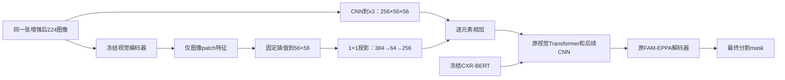

# 第二方向深入研究：为 BetterLViT 接入冻结视觉预训练特征

核查日期：2026-09-08。范围为公开论文、作者实现/模型元数据、项目冻结源码与已有结果；不是系统综述或原创性认证。本轮未连接训练服务器、下载模型权重、训练或重新评估 Test。

## 1. 决策

**值得投入一次受控的可行性实验。首选 CXformer-S 胸片视觉编码器；用同结构的自然图像 DINOv2-with-registers-S 比较预训练来源，DINOv3-S 保留为第二候选。** 这一排序基于领域匹配、模型大小、访问条件和对照是否容易做清楚，不代表已经证明 CXformer 的病灶分割更好。

从 C4 的冻结源码出发，保留 FAM-EPPA 和冻结 CXR-BERT，在一处中层特征接入外部视觉表示。第一版只用普通残差投影，不增加监督头或 loss，也不取原创模块名。先回答“有没有可利用的新信息”，再回答“是否需要新的融合机制”。

与上一份报告相比，本次有三项实质推进：筛出可直接对照的胸片小模型；发现直方图均衡化、输入分辨率及非图像 token 等接入陷阱；将接入点、预算、预检和淘汰规则细化。**仍没有本项目新增 IoU 成绩或可承诺的增益区间。**

## 2. 为什么比继续延长 P11 更值得试

当前 P11 150 轮最佳仍为第 80 轮，Test macro IoU 75.5661%、Dice 84.2335%；C4 对应为 75.6396%、84.2989%。延长训练没有更新最佳检查点。来源见[最终归档](../dual_grain_150_results/README.md)。

C4/P11 的视觉 CNN 和视觉 Transformer 未加载外部视觉预训练，文本分支加载了 CXR-BERT。P11 的粗细特征仍是同一套训练数据学出的表示；新增空间粒度没有自动带来更好的病灶/背景区分能力。因此，本方向检验的假设是：**外部预训练可能补充视觉表示，而不是继续重排已有特征。** 这是合理假设，尚非已经确认的瓶颈。

已有 Val 诊断显示 P11 减少误检同时增加漏检，最小总病灶面积组的 IoU 仍约 53%。新特征只有帮助区分病灶、肋骨、心影等混淆区域才有用；若主要表达肺的整体形状，也可能增加肺内背景误检。胸片解剖分割成绩不能直接证明感染区域分割能力。已有分组证据见[上轮复算](../research_after_p11/研究结论.md)。

## 3. 文献告诉我们什么，以及没有告诉我们什么

| 研究 | 可借鉴之处 | 对本项目的限制 |
|---|---|---|
| [SegDINO，2025-09 预印本](https://arxiv.org/html/2509.00833v1) | 冻结 DINOv3-S，取多层特征，用轻量解码头训练分割；说明无需先设计复杂交互才能检验预训练价值 | 使用自己的交叉熵训练协议，医学数据为超声、内镜、皮肤；没有 QaTa 同协议验证。论文也承认部分组件消融仍待补充 |
| [Dino U-Net，2025-08 预印本](https://arxiv.org/html/2508.20909v1) | 冻结 DINOv3 与局部空间分支结合，通过适配器与投影接入 U-Net | 已经包含可变形交叉注意力、低秩投影及特征调制；普通“全局语义+局部细节”不能再作为我们的独占新意。七个数据集不含本项目胸片感染任务 |
| [CXformer，PMLR 正式论文](https://proceedings.mlr.press/v301/al-mahrooqi26a.html) | 研究 DINOv2 在胸片上的持续预训练，小模型也可有效 | 下游分割证据主要是肺/心解剖结构，分类 AUROC 不等于病灶 IoU。作者仓库标 MIDL 2025，PMLR 条目年份为 2026；引用时保留这一差别 |
| [RAD-DINO，作者模型卡](https://huggingface.co/microsoft/rad-dino) | 胸片自监督模型，可输出密集 patch 特征，提供公开预训练图像清单 | 体量更大；公开权重和论文包含私有数据的设置不同。不能把论文全部结果归给当前公开 checkpoint |
| [D²-Former，MIDL 2026 / PMLR](https://proceedings.mlr.press/v315/mia26a.html) | 双视觉编码器结合 DINOv3、Swin 与动态融合，说明这类混合架构已有直接先例 | 不能将“双分支+自适应融合”本身当作新机制；本轮只将其作为近邻方法，未复现完整训练实现 |
| [GuiDINO，2026-03 预印本](https://arxiv.org/html/2603.01115v1)；[TAMISeg，2026-04 预印本](https://arxiv.org/html/2604.10912v1) | 前者用预训练特征做空间引导，后者有 QaTa 场景的视觉知识迁移 | GuiDINO 包含引导监督，TAMISeg 同时改变蒸馏、预训练、文本交互等；整套照搬不能作为仅改视觉模块的公平对照 |

[MedDINOv3](https://arxiv.org/html/2509.02379v1) 的医学适配重点是 CT；“医学”二字不能消除 CT 与胸片之间的模态差异，因此未将其列为首轮候选。以上研究支持尝试外部视觉表示，不支持给出 BetterLViT 的预期涨点数字。

## 4. 编码器选择：不只比较名字和年份

| 候选 | 模型规模/通道 | 224 输入的 patch 网格 | 官方预处理关键点 | 本轮定位 |
|---|---:|---:|---|---|
| CXformer-S | 约 22.1M / 384 | 16×16，patch14，另有 CLS+4 register | 518，直方图均衡化，ImageNet mean/std | 胸片首选 |
| DINOv2 with registers-S | 约 22.1M / 384 | 16×16，patch14，另有 CLS+4 register | 默认短边 256 后中心裁剪 224，ImageNet mean/std | 同架构自然图像预训练对照 |
| DINOv3-S/16 | 官方约 21M / 384 | 14×14，另有 CLS+4 register | 使用官方归一化；完整配置本轮未获公开访问 | 后续通用视觉候选 |
| RAD-DINO | 约 86.6M / 768 | 16×16，patch14，另有 CLS | 518，mean=0.5307、std=0.2583 | 小模型不足时再考虑 |

元数据来源为四个官方模型仓库：[CXformer](https://huggingface.co/m42-health/CXformer-small)、[DINOv2](https://huggingface.co/facebook/dinov2-with-registers-small)、[DINOv3](https://huggingface.co/facebook/dinov3-vits16-pretrain-lvd1689m)、[RAD-DINO](https://huggingface.co/microsoft/rad-dino)。上表是模型卡/配置事实，输出形状仍须实际前向验证，不能视为已完成 GPU 预检。

CXformer 与 DINOv2-S 的已读配置均为 12 层、6 注意力头、384 维及 4 register，适合比较不同来源的预训练权重。两份配置的显式位置插值字段仍有差异；实现时须核对同一 Transformers 版本的有效配置，保证匹配对照使用同一结构/位置插值规则。这个比较归因于**整个胸片预训练配方**，不能只归因于数据域，因为预训练流程也有变化。

CXformer 权重公开，模型卡标研究用途及 CC BY-NC-4.0；RAD-DINO 权重公开；DINOv3 标为人工审批访问，本轮不带凭据请求配置返回 401。这只能说明公开请求受限，**未检查用户账号是否已有权限**，也没有代替用户申请或接受条件。

CXformer 默认预处理不仅归一化，还逐通道做直方图均衡化。直接把它的默认处理器插进现有流程，可能改变对比度、分辨率和裁剪视野；其示例还以 base 模型输出解释 small 页面。应以已固定版本的配置和真实 shape 为准，而不是复制示例数字。

### 预训练数据交叉必须留痕

CXformer 公开说明使用 CheXpert、MIMIC-CXR、PadChest、NIH、BRAX；RAD-DINO 也披露相关胸片来源。不能凭模型名称就宣称与 QaTa 全部无交叉，也不能因数据来自同一机构便断言泄漏。本轮没有完成患者/图像来源映射与像素去重。

在正式结论前，记录 QaTa 实际分割清单与来源映射，和可用预训练清单核对；文件名比对只能作为线索，不能证明像素级无重复。发现交叉时应去重重做划分或另加独立来源评估，并披露限制。该工作是数据溯源，不使用 Test 指标选择编码器，也不把外部预训练成果归为仅使用 QaTa 从头训练。

## 5. 可实现的第一版：只接一处中层视觉特征

基于 C4 `add4908a0d6f702b0a10c4581725b535543829b8`，而非已经失败的 P11 细分支。当前尺寸为 x1=64×224²、x2=128×112²、x3=256×56²、x4=512×28²、x5=512×14²。

令 Z 是冻结编码器最后一层的图像 patch 特征，U 是固定双线性插值，P 是两个 1×1 卷积与 GELU：

`x3_new = x3 + P(U(Z))`

具体插入在 `x3 = down2(x2)` 之后、`y3 = downVit2(x3, y2, text3)` 之前。这样 x3 的原始像素路径仍在，外部信息可进入后续 CNN 和文本交互；并非将外部注意力当成前景 mask 去乘掉现有特征。首轮不扩展到四层注入、不接多层 DINO 特征、不加入可学习位置偏移或门控。

这是工程假设：中层可能兼顾位置与语义，不是文献已经证明它在 BetterLViT 最优。若后续证明信息有用但融合有干扰，才比较晚期 skip-only 接入等有明确问题指向的变体。

### 参数与资源预算

小模型接入层为 `(384×64+64)+(64×256+256)=41,280` 个可训练参数。若先把冻结特征插值到 56² 再投影，两层卷积每图约 **0.12845G MACs**，不含主模型/编码器/插值/GELU。RAD-DINO 对应 65,856 参数。

batch16、FP32 时，384×56² 的冻结特征单个张量约 73.5 MiB，256×56² 的注入张量约 49 MiB。这些是逐张量解析计算，**不是总显存或实测速度**。还需计入外部模型权重、前向临时张量和训练反传保存内容；冻结并不免除推理时的额外编码开销。

将固定插值放在无梯度的外部特征上，可避免该插值的 CUDA 反传确定性问题；实际整个模型仍需按原协议跑确定性前后向预检。计算见相邻[元数据与预算](encoder_contracts.json)及[复算脚本](audit_encoder_contracts.py)。

### 接入必须守住的行为契约

1. 两分支使用同一次几何增强；外部分支不另做中心裁剪。当前加载器使用 OpenCV，接入时核对是否确为重复灰度通道；如遇非灰度 BGR，仅对外部分支明确转换到 RGB，不能悄悄改变 C4 路径。
2. 明确张量已在 [0,1]，禁止再次除以 255。CXformer 的均衡化需要 uint8；不能直接把标准化后的浮点张量送进 `equalizeHist`。主试默认关闭均衡化，先固定 224 和共同 ImageNet 归一化；均衡化作为有匹配对照的单独预处理因素。
3. 从最后一层输出排除 CLS/register，按实际 H/patch、W/patch 检查数量后 reshape。CXformer/DINOv2-S 在 224 应为 261 个总 token，其中 256 个图像 token；不能把整个序列或 CLS 广播成空间图。
4. 视觉编码器 `requires_grad=False`，整体 `train()` 后仍保持其 `eval()`；前向使用 `no_grad()`。接入层和原分割网络仍用最终 Dice/Focal loss 学习。不能因“冻结编码器”误把整个新增分支也禁用梯度。
5. 第二个投影层零初始化，第一个层正常初始化，保证初始 x3 严格一致。不要再叠加另一个零初始化门控，否则可能阻断学习。第一个投影在首步梯度为零可以是零末层的正常结果，应在至少两步后核查有效梯度。
6. 新模块初始化及外部模型实例化不得消耗原模型/数据顺序使用的 RNG 流；初始化前后恢复相关状态，并证明关闭新增模块时 C4 权重、首批输出和采样顺序一致。
7. 保留原 batch、损失、优化器、调度器、增强和精度。若资源不足，不只给候选改 batch/AMP；应重设整个匹配对照。元数据所见版本也不等于当前服务器已经安装的版本，启动前另存实际环境。

原图冻结特征可以用于固定视图的离线探针，但不能用“先缓存原图再翻转特征”代替正式训练的增强后重提取。视觉 Transformer 对几何变换不是严格等变的。

## 6. 按成本分阶段验证，最终成绩仍以 Test 为准

### A. 先做小型 Train/Val 特征探针

仅在 Train 训练相同的轻量分割读出头，Val 比较 CXformer-S 和同结构 DINOv2-S；两者用同一固定视图、头初始化、优化预算、阈值和已有 mask 标签。它是表示诊断，**不是给 BetterLViT 新增一个监督分支或创新 loss**。不要求冻结编码器独立分割成绩超过完整 C4。

先固定 224、无均衡化。如果胸片模型不占优，再补同一两编码器的均衡化开/关小对照，区分权重与对比度。224 结果差也不能直接否定在默认 518 下的表示；必要时做匹配的 518 探针。将同一 224 图放大到 518 只增加 token 网格/计算，不增加原图信息；使用原始高分辨率图是另一个资源条件，必须另列。

探针只筛选接入候选与输入契约。读出头能力、冻结程度和无增强视图均有限制，单个探针失败不构成整个方向失败。不上来训练 RAD-DINO-B，也不同时扫编码器层号、四个插入位置与多种注意力。

### B. 再做普通接入的配对分割实验

| 组别 | 目的 |
|---|---|
| C4，80轮 | 主基线；只有关闭分支后初始化/训练协议完全等价，才复用现有结果，否则重跑匹配控制 |
| C4 + 所选预训练冻结编码器 + 普通投影，80轮 | 测整体是否提高 IoU |
| C4 + 同配置随机冻结编码器 + 同投影，80轮 | 区分预训练信息与额外计算/特征变换/可训练投影；输入处理也必须一致 |

从头训练分割网络，保留外部预训练权重；不是加载 C4 Best 后继续训练。这样不把额外训练轮数混入模块收益。若使用均衡化视图，其随机编码器控制也接收同样视图；预训练来源比较需要时补自然图像权重的同接入组。

预注册建议：seed1219、batch16、224、80轮、阈值0.5、Val macro IoU 选 Best；其余继承 C4。**单种子继续投入门槛**为相对匹配 C4 的 Val macro IoU ≥ +0.003、逐图配对 bootstrap 95% CI 下界 > 0，macro Dice 与预先固定最小面积组 IoU 点估计不下降，并优于随机特征控制。+0.003 是决策门槛，不是涨点预测。Precision/recall 同时报出以辨别 FP/FN 交换，但不因单独一种指标波动而掩盖 IoU 的实际改善。

80轮未通过则记录失败，不沿用 P11 的方式加到150。如果 20/40 轮只是优化过程检查，不把它和 C4 最佳80轮作公平比较，也不临时下调门槛。正式推出独立新机制前，普通接入这一关必须有证据。

### C. 跨种子和 Test

固定选中的结构与预处理，再做至少3个配对种子（建议预登记1219、2027、3407）。先报告每个种子的 Val 增益、均值和标准差；单个种子的逐图 bootstrap 不代表训练稳定性。有正向跨种子证据后，按既有授权对冻结配置的 Val-Best 自动进行 Test 评估，最终表用 **2113张 Test 的逐图 macro IoU/Dice @0.5**。

Test 只用于最终报告，不用于在上述编码器、均衡化、阈值和接入位置之间挑选。历史 Test 已被项目多次查看，不能称全新未见测试集；最终论文应说明迭代背景，条件允许时补独立来源验证。若 Test 不支持增益，就按用户要求以 Test 结论为准。

只有正式启动训练时才建立预测检查：每组至多两次短连接检查，最后一次安排在预计训练结束后，并以实际训练结束为起点核验间隔不超过30分钟；估时来自实际预检/轮时，服务器训练日志正常记录不算人工远程检查。如果检查时后续评估尚未完成，不报告最终指标。结束时间预测存在误差，调度方案应处理提前结束/失败，不能把预计满足写成已保证满足，也不使用持续 SSH 连接。本轮没有新建或修改计时任务。

## 7. 与 EPPA 的关系和第二创新边界

预期分工是：外部模型提供预训练视觉表示，EPPA 融合原有多尺度/频率信息。当前只是待验证的互补关系。

若普通接入有效，最有价值的后续问题是：**粗粒度外部语义如何帮助定位，同时保留当前像素分支对弱病灶的证据？** 先看错误图、FP/FN 变化和面积分组，确认是空间失配、通道失配还是特征本身不足，再针对实际问题设计机制。尚未看到这些证据，不能先发明一个名称再把所有失败都解释为缺少门控。

近邻文献已覆盖冻结骨干、局部/全局双分支、低秩投影、可变形对齐及动态融合。项目也试过空间重采样、文本路由、可靠性调节、原型和频率权重。故目前 **“CXformer/DINO + 普通投影 + EPPA”是必要性能基线，可构成工程改进，不能直接宣称独立原创算法**。

若开发出新机制，至少补：同预训练资源下的相加/拼接+投影对照，以及 EPPA 开/关 × 新机制开/关的2×2消融。两模块合用优于各自单用支持互补；声称“协同增益”还应检验交互差值 `I11-I10-I01+I00`，不能仅凭合用分数最高得出协同结论。优先级仍是可复现 IoU，若普通接入已经够好，不为凑创新继续堆叠模块。

## 8. 可复核材料和当前状态

- 模型版本、公开配置、处理器及 SHA256：[encoder_contracts.json](encoder_contracts.json)。四个仓库固定完整 revision；DINOv3 的访问限制原样保留。CXformer 自定义预处理源码只读取核查和哈希，没有执行或引入项目。
- 重取元数据及计算参数/张量预算：[audit_encoder_contracts.py](audit_encoder_contracts.py)，Python 标准库即可运行，不下载权重，不读取训练数据，不使用凭据。
- 实际源码依据：C4 `add4908a0d6f702b0a10c4581725b535543829b8` 的 `nets/LViT.py`、`nets/BetterLViT.py`、`Load_Dataset.py`、`Config.py`、`requirements.server-cu128.txt`；P11继续训练源 `c724a62001f6c3b809cb12eee78f3bee79bdb60a`。
- 正式实现时另建独立源码提交和实验标签，保存完整 SHA、外部权重 SHA256、输入契约、运行版本、数据划分及训练/Val/Test 状态；本次研究文档提交不能代替未来实验源码溯源。

**已完成：定向文献与权重元数据核查、接入设计、解析预算及实验决策方案。未完成：模型权重访问/下载验证、患者级预训练去重、实际特征探针、联合 GPU 预检和训练。第二创新与稳定 IoU 增益均尚未成立。**
