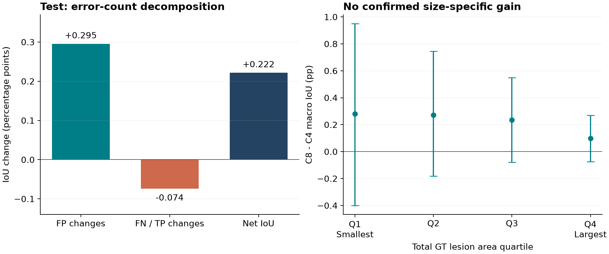
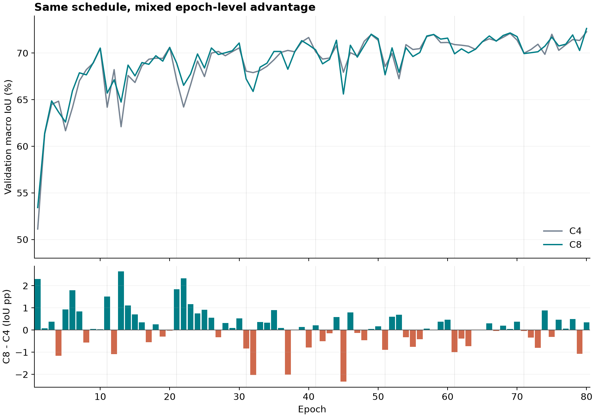

# C8 为什么提升：从误差变化、训练过程到梯度路径

分析日期：2026-09-10。对象：C4、C8、P10，seed1219。所有最终性能使用逐图 macro Test 指标。本文只复算历史 Test/Val 记录、提取既有检查点历史，并在固定32张Train图像上做无参数更新的诊断；没有重训或新增Test推理。

## 1. 核心判断

**C8 的小幅 Test 改善，直接表现为误检减少；目前最可信的机制解释是多尺度视觉辅助监督改变了编码器的学习过程。像素监督和区域存在监督都有实际视觉梯度，面积占比项在已训练检查点上的作用较弱，文本辅助任务没有直接视觉梯度路径。**

这个判断需要拆成三种证据强度：

| 层次 | 当前支持的结论 | 不能扩大成的结论 |
|---|---|---|
| 结果事实 | Test IoU从75.6396%到75.8612%，增加0.2216个百分点；主要对应误检减少 | 已取得显著、跨种子稳定或历史最佳成绩 |
| 代码与本次干预 | 三项视觉辅助loss连接共享编码器；关闭辅助分支不改变32张Train的推理输出；文本项无视觉梯度 | 文本辅助带来了分割收益，或推理路由解释了C8改善 |
| 机制推断 | 多尺度像素/区域任务可能提供轻量的表示约束，纠正部分面积偏差 | 像素/存在/占比各自贡献了多少IoU；三项都必不可少 |

**C8值得继续拆解，但现在还不是已经解决的第二创新点。** 最有价值的下一步是从这组视觉监督中找到必要成分，并验证它在R2训练配方上仍有增益。增加模块数量或继续延长训练，不能解决当前的归因缺口。

## 2. 改善有多大，证据有多稳

同为2113张Test、阈值0.5、Val IoU选Best，三组Best均为第80轮。

| Test指标 | C4 | C8 | C8−C4 |
|---|---:|---:|---:|
| macro IoU | 75.6396% | 75.8612% | +0.2216个百分点 |
| macro Dice | 84.2989% | 84.4313% | +0.1324个百分点 |
| macro Precision | 83.9363% | 84.3207% | +0.3844个百分点 |
| macro Recall | 87.4378% | 87.3427% | −0.0951个百分点 |
| Brier，越低越好 | 0.01693788 | 0.01674025 | −0.00019763 |
| Boundary F1，容差2像素，仅评估 | 78.4371% | 78.8783% | +0.4412个百分点 |

来源：[历史C4/C8 Test配对结果](../../20260907/race_pe_v2_test_20260907/c4_vs_c8_test.json)、[本次逐图复算](results/test_analysis.json)。Boundary F1是评价指标，不代表使用了boundary loss。

原始配对图像bootstrap的IoU差值95%区间为 **[−0.0004467,+0.4463012]个百分点**，下界虽然非常接近0，但确实为负；Dice区间也跨0。Precision区间为[+0.1823,+0.5844]个百分点，Brier区间也支持下降。相比“IoU稳定提升”，**误检控制有所改善的证据更清楚**。

Test文件名可解析出474个subject ID，最多一个ID对应36张图像。以这些ID为单位重新抽样、仍估计逐图均值，IoU差值区间为 **[−0.0025324,+0.4394622]个百分点**，同样跨0。此检查考虑同一ID多张图像的相关性；它仍不是训练种子重复。Val/Test中可解析的subject ID集合没有交集，但本轮没有据此声称完成了所有来源和Train的患者级去重审计。

逐图来看，C8胜1114张、负988张、持平11张，胜率52.72%；IoU差值中位数仅+0.0873个百分点。两端各截去1%或5%的极端样本后，平均差值仍分别为+0.1812和+0.1748个百分点。因此，改善不是完全由几张极端成功案例撑起来；它也没有覆盖绝大多数样本。所有分层、截尾及新增区间均为事后描述，不是新的确认性显著性检验。

历史Test已被多轮研究查看，不能重新称作未触碰的独立留出集。本分析不调整阈值、Best或方法选择来最大化现有Test分数。

## 3. IoU为什么变好：误检收益超过漏检代价

从每张图像的标签面积、预测面积和Recall重建整数TP、FP、FN，再逐图重算IoU、Dice、Precision、Recall，与原记录在1e−12以内一致。

| 每图平均像素数，224×224 | C4 | C8 | 变化 |
|---|---:|---:|---:|
| 误检FP | 654.26 | 624.87 | −29.39，约−4.49% |
| 漏检FN | 444.84 | 459.58 | +14.74，约+3.31% |
| 预测前景面积 | 6177.08 | 6132.95 | −44.13 |

不能用汇总像素直接解释macro IoU：每张图像面积不同，IoU是非线性的。为保持逐图口径，本分析利用固定标签面积G下的 `IoU = TP / (G + FP)`，对“先改变FP再改变TP”和相反顺序各计算一次，再取平均。这是对称代数分解，两个贡献严格相加为实际差值。

| 对Test macro IoU差值的分解 | 百分点 |
|---|---:|
| FP变化贡献 | +0.295425 |
| TP/FN变化贡献 | −0.073875 |
| 合计 | **+0.221550** |

**所以，C8整体上不是靠“找回更多病灶”赢，而是减少了足够多的误检，抵消了新增漏检。** 这里分解的是两个检查点的预测差异，不能把+0.295425直接记到某项loss名下。[分解代码与独立算例](analyze_records.py)、[逐图数据](results/test_paired.csv)。



图左为代数分解；图右为事后GT总面积四分位的IoU差值及图像bootstrap95%区间。图中pp表示百分点。用于重绘的数字见[JSON](results/test_analysis.json)，图片及PDF由[绘图脚本](make_figures.py)生成。

### 3.1 它不是把所有分割结果统一缩小

按C4的预测面积相对GT面积分组：

| C4原有面积偏差 | 图像数 | C8平均FP变化 | C8平均FN变化 | IoU差值 |
|---|---:|---:|---:|---:|
| 预测面积大于GT | 1373 | −50.40 | +33.99 | +0.1524个百分点 |
| 预测面积小于GT | 737 | +9.78 | −21.06 | +0.3520个百分点 |

另有3张面积相等。这里的“面积大/小”不代表预测集合完整包含GT，也不能等同纯误检/纯漏检。

原本预测面积不足的图像中，C8平均补回更多真阳性；原本面积过大的图像中，C8更倾向减少误检。这与**纠正部分面积偏差**相容，而非所有图像发生同向收缩。不过，分组依据本身来自C4预测，存在条件选择与回归均值效应；两组IoU区间也跨0，不能把它直接命名为已经证明的“自适应纠偏机制”。

### 3.2 小面积和大面积图像的变化不同

| GT总病灶面积四分位 | 范围/像素 | 图像数 | IoU差值/百分点 | FP变化/图 | FN变化/图 |
|---|---:|---:|---:|---:|---:|
| Q1最小 | 200–2414 | 529 | +0.2811 | +16.16 | −12.41 |
| Q2 | 2423–5375 | 528 | +0.2716 | −29.32 | +12.82 |
| Q3 | 5390–9067 | 528 | +0.2350 | −41.59 | +17.82 |
| Q4最大 | 9069–22317 | 528 | +0.0983 | −62.90 | +40.80 |

Q1的改善方向是召回更多前景，后三组主要是减少误检。Q1的Brier反而增加约0.000252，而后三组下降，说明概率预测质量并非所有面积范围同时改善。四组IoU区间全部跨0。

这些分组使用**整张图的GT总面积**，不是连通病灶尺寸或微小病灶检出率。不能把Q1点估计包装成“已解决小病灶”。

Val总体IoU增加0.3551个百分点，比Test的0.2216大。Val中FP平均减少41.72，FN增加11.91，但逐图代数分解中FP贡献+0.3181、TP/FN贡献+0.0370个百分点。后者和平均FN像素变化方向不同，正说明不能用总体像素数替代macro归因。Val文件名前缀分组也有异质性：`sub-S`组+0.5026个百分点、`covid_`组+0.1494；这些只是名称分组，不能未经数据源核实就称作医院或域迁移效应。[Val分析](results/validation_analysis.json)。

## 4. C8究竟增加了什么监督

C8的实际总目标可以写成：

```text
L = 原始主分割Loss（Dice/Focal各0.5）
  + 0.0200 × 多尺度像素BCE
  + 0.0100 × 六区域存在BCE
  + 0.0050 × 六区域面积占比MSE
  + 0.0075 × 文本区域提及BCE
  + 0.0025 × 文本数量CE
```

三项视觉loss分别在四个尺度取平均。原配置外层aux_weight为0.05，上式已经把内部系数乘入，不能再乘一次。报告到视觉一致性项在V2为0；C8关闭推理路由。代码：[冻结C8目标函数](https://github.com/razaxq/BetterLViT/blob/21606e02c2d64ae950c0f243f55163f58cbedf83/race_pe_objective.py)、[RACE-PE结构](https://github.com/razaxq/BetterLViT/blob/21606e02c2d64ae950c0f243f55163f58cbedf83/nets/race_pe.py)。

### 4.1 像素监督：让四层编码特征直接承担可分割性要求

辅助头连接`inc/down1/down2/down3`的编码器特征，分辨率分别224、112、56、28，通道分别64、128、256、512。每层通过轻量1×1卷积、归一化和非线性预测像素证据。

GT采用面积平均下采样：粗尺度目标保留部分前景占比，而不是把所有混合格点都硬判成前景或背景。普通BCE同时对背景与前景提供稠密约束；主任务仍是原Dice/Focal。

**合理解释：** 编码器除了经由完整解码器接收主任务梯度，还被要求在多个尺度上提供能区分病灶和背景的特征。这可能降低模型只依赖最后几层补偿特征不足的程度，并约束容易导致误检的响应。当前没有测得“C4梯度消失”，所以不能把改善归因于已经证实的梯度消失修复。

在隐藏层增加辅助目标、改善特征判别性和优化路径，是已有的深监督思想；C8不能仅凭“四层都有loss”声称原创。[Lee等，Deeply-Supervised Nets，AISTATS 2015](https://proceedings.mlr.press/v38/lee15a.html)。

### 4.2 区域存在监督：回答“这一块有没有”，而不是“这一块全是”

每层按六个矩形区域池化特征，由独立线性头判断该区域是否含任何GT前景。存在标签由区域占比是否大于0产生，和像素范围预测分开。

**合理解释：** 同一编码器需要同时保留局部像素信息和区域级病灶证据。存在任务可以提醒网络保留稀疏病灶线索，而不把“某区有病灶”错误翻译成“整个区域都应填满”。这种语义拆分与C8最小面积组Recall上升相容，但不能凭这种对应关系确认因果。

六区是随图像增强变换的几何区域，不是真实肺叶分割。它们在现有C8中已经存在；下一版不能把同一设计换名再次计算成创新。

### 4.3 占比监督：直接限制区域平均前景量

占比MSE比较辅助像素概率在区域内的均值与GT前景占比。它能惩罚某区预测过多或过少，但不能单独保证轮廓或病灶位置正确。

**合理解释：** 这项约束可能帮助控制面积偏差，与本次FP/FN分组现象方向一致。不过，它的系数小，且下节梯度诊断显示在Best检查点上非常弱。因此，“C8主要靠面积MSE提升”目前缺乏证据。不能因为一个机制叙事好解释，就忽略它实际作用强度有限。

### 4.4 文本辅助：在C8中是一条独立旁支

文本槽头读取原始、冻结的CXR-BERT表示；它和主网络已有的文本适配层不共享可训练参数。C8路由关闭，V2报告到视觉一致性项也关闭。因此文本提及/数量loss只训练独立槽头，没有直接到视觉编码器的梯度路径。训练代码中也没有通过全局梯度裁剪耦合两条分支。

**这不表示BetterLViT没有使用文本。** 主模型原有的图文流仍然存在。被排除的是“新增文本辅助loss直接教会视觉主干”的解释。槽头任务收敛好，不等于主分割获得了相同的信息增益。[文本编码及主流](https://github.com/razaxq/BetterLViT/blob/21606e02c2d64ae950c0f243f55163f58cbedf83/nets/BetterLViT.py)、[槽头结构](https://github.com/razaxq/BetterLViT/blob/21606e02c2d64ae950c0f243f55163f58cbedf83/nets/race_fuse.py)。

## 5. 本次实际梯度诊断提供了什么新证据

按预先固定的文件名SHA256顺序选32张Train图像，4批、每批8张；使用C8 Best、Val预处理、eval模式、确定性计算。所有loss均按真实训练系数加权。只调用梯度计算，没有创建optimizer或执行更新。

下表为各层上四批统计的均值；百分数表示 **辅助项对该层输出特征的梯度范数 / 主loss对同一特征的梯度范数**。

| 加权辅助项 | 224层 | 112层 | 56层 | 28层 |
|---|---:|---:|---:|---:|
| 像素BCE | 1.022% | 1.005% | 1.013% | 0.912% |
| 区域存在BCE | 0.791% | 0.720% | 0.627% | 0.510% |
| 面积占比MSE | 0.0316% | 0.0300% | 0.0282% | 0.0230% |
| 三项视觉监督合计 | 1.517% | 1.427% | 1.316% | 1.090% |
| 文本提及/数量 | 无连接 | 无连接 | 无连接 | 无连接 |

像素项在此快照中最强，存在项也不能忽略，占比项明显较弱。合计范数不等于各项范数相加，因为梯度有方向。即使存在BCE的标量loss比像素BCE大，它的特征梯度仍较小，说明**只看loss数值或配置权重不能排序实际作用**。

三项视觉监督合计与主loss的梯度余弦，在所有4批×4层上均为正，范围约0.0168–0.2473。这表示当前局部特征空间中存在弱正向一致性，未观察到平均方向冲突；不是充分的训练稳定性或泛化证明，也不是参数空间中的Adam更新分析。不同层输出互相依赖，这些比值不能跨层相加。文献已有用任务梯度相似度判断或调整辅助权重的研究，不能将简单的余弦加权本身当作新发明。[Du等，2018，2020修订](https://arxiv.org/abs/1812.02224)。

同时验证：

- 文本提及和数量项对四层视觉特征均返回未连接梯度，而文本槽头自身梯度非零，排除了“因为文本loss没有计算才为0”。
- 关闭整个RACE辅助分支，32张Train输出与开启时逐值完全相同，最大绝对差0。这也符合`route_enabled=False`的代码路径。
- 模型所有参数与持久buffer的状态SHA256前后相同，并和原C8 Best提取的状态哈希一致：`a12273ff843510be8f321cd70939e3db2d5d0d54e6888fde52efe31cf2fd3b31`。

当前实现推理时仍计算辅助分支，只是结果对C8最终输出没有作用。它可以进一步裁剪，但本轮没有改写部署代码或测量裁剪后的速度，不能报告“实测零额外开销”。

**这只是训练结束后的32张Train/eval快照。** 它不能恢复训练早期的梯度，不能证明占比项从始至终不重要，也不能用1%的梯度比例推导0.22个百分点的IoU增益。原始证据：[GPU诊断JSON](evidence/c8_gradient_probe.json)、[聚合结果](results/gradient_analysis.json)、[复现代码](remote_probe.py)。

## 6. 学习率、训练时长和Best选择是否混淆了结论

三份Best检查点均提取了完整80轮历史。C4/C8的80个逐轮学习率完全相同：10轮周期的余弦重启，基准3e−4、下限1e−4；第80轮实际使用0.000104894348。它们都不是后来R2的贯穿80轮单次余弦。

两组同为batch16、seed1219、224、Adam、原Dice/Focal、无LoRA和boundary loss，使用同一增强与Val选择规则。两份Test脚本的唯一文本差异是增加允许的C8/P10模型名称，指标计算没有变。[脚本差异](evidence/evaluation_script.diff)、[来源核验](evidence/source_audit.json)、[C4历史](evidence/c4_history.json)、[C8历史](evidence/c8_history.json)。

| 指标 | C4 | C8 | C8−C4 |
|---|---:|---:|---:|
| 第80轮Val IoU | 72.2796% | 72.6347% | +0.3551个百分点 |
| 最后10轮Val IoU均值 | 70.9420% | 70.9111% | −0.0309个百分点 |
| 最后20轮Val IoU均值 | 71.0759% | 71.0009% | −0.0751个百分点 |
| 最后40轮Val IoU均值 | 70.6757% | 70.5893% | −0.0864个百分点 |
| 第80轮Train主loss | 0.089872 | 0.089123 | −0.000748 |
| 第80轮Val主loss | 0.102799 | 0.101039 | −0.001761 |

C8在全部80轮中有51轮Val IoU高于C4，但最后10轮仅5轮更高。虽然Best改善且主loss降低，不能说它带来了持续占优的后期轨迹。两组都受周期性学习率变化影响；同一训练过程的相邻epoch高度相关，上述窗口均值不是独立重复实验，不能据此另做显著性主张或事后改选检查点。

C8总loss包含新增辅助项，直接拿它和C4总loss比较会产生误判。表中已从检查点记录中单独提取相同的主loss。



所以，**不同训练时长、不同阈值、不同评估公式不是这次差值的解释；但Best端点的改善也没有得到稳定后期轨迹和多种子复验的共同支持。** 相同seed并不自动保证修改网络后所有随机数轨迹都一致，本轮未重放从初始化到训练结束的全部随机状态；后续消融仍需显式核对共享参数初始化、数据顺序和随机数消费。[逐轮CSV与摘要](results/history_paired.csv)。

## 7. 为什么C8比继续做推理纠错更值得拆解

C8通过训练约束改变编码器特征，推理时仍使用原主网络路径。与额外叠加预测修正相比，它不需要一个新模块在推理时决定哪些像素该增大或缩小。这个差别提供了合理的机制解释，但并不能单独证明它优于所有纠错方法。

现成的P10对照进一步限定了结论：P10在C8辅助监督基础上开启路由，Test IoU为75.8090%，比C8低0.0521个百分点，区间跨0；Precision下降1.0921个百分点，Recall上升1.2134个百分点。因此，路由没有提供已证实的额外IoU价值，反而再次呈现扩大预测范围的趋势。[C8/P10配对结果](../../20260907/race_pe_v2_test_20260907/c8_vs_p10_test.json)。

但不能把P10−C8当作单个已训练模型的开关干预：P10开启路由后，整个训练轨迹及文字槽头的梯度也变了。真正的同检查点开关验证只在本轮C8 Train诊断中完成。

Brier下降和Boundary F1上升说明差别不止表现在一个IoU均值上；但Brier同时反映预测准确性与概率质量，没有可靠性曲线或其他拆分时，不能宣称已经解决校准问题。固定阈值0.5排除了“人为挑阈值”的解释，**没有排除训练导致概率尺度或边界位置改变**。

## 8. 对第二创新点和下一步实验的实际建议

建议把问题收敛为：**如何让视觉辅助监督提供有用的多尺度表示约束，同时减少中大面积图像的漏检代价？** 这是基于现有证据的研究问题，不是已验证的新方法名称。

普通深监督已有长期研究；医学分割中按目标平均尺寸与层级有效感受野匹配来选择辅助监督位置也已有工作。[Mishra与Chen，2024](https://arxiv.org/abs/2402.02649)。因此，“加辅助头”“按尺度给权重”“按梯度相似度加权”都不能单靠重新命名成为创新点。先确认必要成分，再围绕真实失败模式设计机制，更符合当前优先提升IoU的目标。

建议的最小因果实验顺序如下；本轮仅提出，没有启动。

| 对照 | 需要回答的问题 | 固定条件 |
|---|---|---|
| R2原模型 | 强训练配方下的参照 | 现有单次80轮余弦、固定主loss |
| R2 + 像素监督 | 普通深监督是否已经足够 | 像素有效系数0.02；四尺度不变 |
| R2 + 像素+存在+占比 | 区域任务是否有像素监督之外的增量 | 三项有效系数0.02/0.01/0.005，不重新归一化 |
| 仅在上一组有额外价值时：分别移除存在/占比 | 哪个区域任务必要，哪个只是附带 | 其余系数、初始化、数据、预算相同 |

先做同seed、同数据顺序的完整80轮Val筛选，记录多个训练阶段的梯度与面积偏差；通过后再做匹配种子复验，最终统一评价Val选定的Best。沿用现有IoU增益及Precision、小面积组、Brier非退化门槛，不因为某组差一点就事后放宽。所有最终性能仍以Test为准，但不拿反复试验的Test来调参。

不应根据本次Best快照直接把占比项权重提高几十倍，也不应立即给三种loss都套“自适应”模块。像素监督如果已经复现完整组合的收益，那么区域组合不能被声称是必要创新；如果R2上收益消失，应优先考虑C8只是补偿旧训练配方的不足。

C8的Test IoU75.8612%也没有超过现有R2三种子均值75.9833%，更不能据此宣称超过历史最强EPPA。这只是项目水平参考：单seed与多seed均值、不同训练配方不构成严格配对消融。[现有R2结果](../recipe_test/results/README.md)。

## 9. 复现、来源与检查

- 原训练完整SHA：C4 `add4908a0d6f702b0a10c4581725b535543829b8`；C8 `21606e02c2d64ae950c0f243f55163f58cbedf83`；P10 `2f33a71219ed2beb339db45d702ecc36a931e0c8`。对应检查点和服务器路径见[manifest](manifest.json)。
- 诊断计划与首版代码先提交：`d0104c9d53d80e27e6f5ac2f1dc2c168205280fb`。首轮在干净源代码检查处停止，原因是既有`datasets`符号链接；未加载图像或更新模型。[原始停止记录](evidence/probe_attempt_1.md)。
- 修订检查仅允许该已知数据符号链接，实际成功诊断源码：`3c3d53fb91dd74c8a9481ab65caef35117e04154`。服务器跟踪源码未修改；所有其他未跟踪变化仍会被拒绝。
- 成功GPU诊断：PyTorch2.9.1+cu128、CUDA12.8、RTX4090D，计算阶段8.43秒，峰值分配9,831,910,400字节。耗时不含模型与数据初始化，不能作为完整评估/训练时间估计。
- 5项独立计数/分解测试通过；全部原始逐图指标重算通过；80轮LR一致；梯度脚本哈希、原模型状态哈希、32张输出一致性均通过；两张图已人工视觉检查。

本地复算，先切换到本报告所在目录：

```powershell
python -X utf8 -m unittest test_analysis.py
python -X utf8 analyze_records.py
python -X utf8 analyze_histories.py
python -X utf8 analyze_gradients.py
python -X utf8 audit_sources.py
python -X utf8 make_figures.py --deps D:/BetterLViT/outputs/c8-analysis-deps
```

前三类统计需要NumPy；绘图需要Matplotlib。本机独立绘图依赖目录安装了Matplotlib3.11.1/NumPy2.5.3，未改全局Python。`audit_sources.py`内的本机代码工作树根目录在迁移机器时需调整。图像bootstrap均为10000次、seed1219；本轮Val排序/抽样序列和历史区间略有差别，报告的原始整体Val/Test判断保持原始归档口径，新增分层使用本轮结果。

远端诊断的入口是[remote_probe.py](remote_probe.py)的`history`和`probe`子命令，分别传入manifest、输出目录、诊断完整SHA。脚本固定只构造Train loader，使用离线模型缓存，无optimizer。复现应使用与manifest一致的服务器代码版本和原始数据，不能用其他检查点代替。

## 10. 来源索引

项目证据优先于文献推断：

1. [原始C4/C8 Test比较，2026-09-07](../../20260907/race_pe_v2_test_20260907/c4_vs_c8_test.json)。支持总体效果与原始区间。
2. [本次Test逐图分析](results/test_analysis.json)、[Val逐图分析](results/validation_analysis.json)。支持误差分解、分层、尾部及subject抽样。
3. [完整80轮历史分析](results/history_analysis.json)。支持学习率一致、端点与后期窗口差异。
4. [固定Train梯度诊断](evidence/c8_gradient_probe.json)。支持计算图连接、局部梯度与无参数更新验证。
5. [C8冻结源码目标函数](https://github.com/razaxq/BetterLViT/blob/21606e02c2d64ae950c0f243f55163f58cbedf83/race_pe_objective.py)。支持各项系数和目标定义。
6. [Lee等：Deeply-Supervised Nets，AISTATS/PMLR38，2015](https://proceedings.mlr.press/v38/lee15a.html)。用于界定普通深监督已有基础，不证明C8的因果贡献。
7. [Du等：Adapting Auxiliary Losses Using Gradient Similarity，2018首发、2020修订](https://arxiv.org/abs/1812.02224)。用于解释辅助梯度方向分析的背景和创新边界。
8. [Mishra与Chen：Densely Decoded Networks with Adaptive Deep Supervision for Medical Image Segmentation，2024预印本](https://arxiv.org/abs/2402.02649)。用于界定目标尺寸/尺度选择式辅助监督已有研究；本文未声称其为当前SOTA或直接复现其方法。
