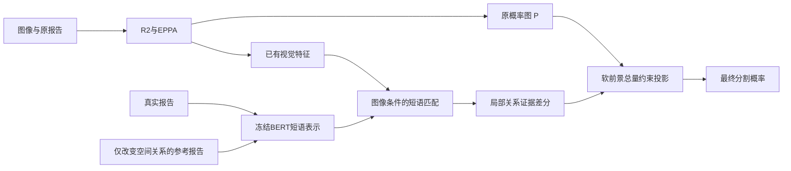

# BetterLViT文字引导创新点的证据、可行性与已有研究核查

## 研究结论

**文字仍有可能提升IoU，但当前证据不足以保证稳定增益。建议将第二创新点的候选收窄为“文本关系引导的概率重分配”：让新增文字通路学习病灶应落在哪里，同时约束其整体扩大前景的自由度。** 这是一项需要验证的模型机制，暂不赋予“首创”“因果分割”或已成立创新点的表述。

推荐理由来自三项项目证据。第一，C8的可确认收益主要来自视觉辅助监督，不能满足新增文字贡献的要求。第二，P10加入文字路由后，Val召回上升而精确率下降，IoU没有优于C8。第三，本次Train文本审计发现了可用于空间关系研究的数据基础，且排除了“32-token截断导致文字丢失”这个直觉解释。

研究时间界限为2026-09-11，按QaTa-COV19-v2、冻结CXR-BERT、EPPA V4-B、单卡和R2训练预算判断可行性。公开论文覆盖医学文字分割及普通/遥感指代分割，不以另一领域已经存在的方法作为医学领域的全新原理。正式论文、预印本、仅获取摘要的来源在下文区分。**未发现完全相同的组合，不等于证明不存在。**

本次完成文献核查、5716条Train文本的可复现静态审计，以及概率投影的CPU数值验证。没有读取Test进行新分析，没有运行新模型训练或远端训练检查。已在执行的RS3继续完成原注册流程；本报告是后续方向建议，不改变其配置、判定门或预约。

## 1. 先明确：什么才算“文字上的创新”

模型接收文字，不代表新增模块的收益来自文字。额外参数、额外像素loss、学习率变化，甚至仅输入模板编号，都可能让成绩提高。对于本项目，第二点应满足三个条件：

1. 新增机制在推理时确实使用输入描述中的信息，改变语义关系会改变它的空间行为。
2. 正确文字带来的IoU收益高于语义无效但容量相当的对照，且不会只表现为置信度或前景面积的整体变化。
3. 相对最接近已有方法有清楚、可消融的差异，最终在冻结方案和匹配种子下获得Test证据。

“不增加新的监督loss”可以是首轮设计选择，但不应成为评价创新的唯一标准。监督与loss本身也可产生研究贡献；这次选择的重点是用户要求的文字在推理中的作用。常规Dice/Focal仍用于学习，只是不把另一项像素监督包装成文字创新。

QaTa文本描述的是全部肺部感染的粗粒度范围和位置。它与“按句子只分割某一个物体”的普通指代分割有差别。删除描述中的某个区域，不等于该处病变消失；将left改为right，也不能据此生成一张“真实的错误报告对应mask”。后续实验必须保持这个任务语义。

## 2. 现有代码实际上怎样使用文字

本次检查冻结源码`f79842331e4e5e41526ed66da31ec174ea4a61b2`，六个源码文件SHA256随[审计JSON](train_text_audit.json)保存。这里分析其沿用的主干文字通路；RS3的区域loss与这些结构结论分开。正式R2来源是`9eca26de5b301099805530edbf5a1a8718bea662`。

| 代码位置 | 已核实行为 | 对研究的含义 |
|---|---|---|
| `Config.py`、`nets/BetterLViT.py` | CXR-BERT-specialized冻结，接收attention mask，返回最后一层token状态；长度32 | 有医学文本表示，但冻结语言表示与分割特征是否对齐仍需验证 |
| `nets/LViT.py` | 四层Conv1d逐步将768维文字特征降至64维 | 不等于四个尺度均进行了显式图文交叉注意力 |
| `nets/Vit.py::VisionTransformer.forward` | 直接注入只发生在dim=64的下行分支；CTBN3将固定文字序列位置作为通道投影至196个patch | 注入本身不根据当前图像选择短语对应位置；随后自注意力仍可学习图文关系，因此不能断言模型不懂文字 |
| `nets/eppa.py` | 文字通道调制和语义区域FiLM读取`text[:,0,:]` | 使用整句CLS摘要，不能据此推断摘要完全没有方位信息，但缺乏显式短语绑定接口 |
| `Load_Dataset.py` | BERT分词有mask；CTBN3未显式使用该mask；几何增强保持原报告token | padding后续影响是待测假设；几何关系模块须明确坐标系，不能机械把图像翻转理解为患者左右发生变化 |

因此，值得检验的是**文字信息是否通过合适的空间接口进入模型**，而不是先更换一个更大的语言模型。本文也不把CTBN3直接换成普通cross-attention称为创新：这应是必要的工程基线。

## 3. 本次Train文本审计：真正有哪些信息可用

审计使用本地迁移包的`Train_Folder`成员列表，仅分析同名工作簿中的5716条Train记录；工作簿虽然含Train/Val行，但Val行未进入统计。未读取图像或mask内容。记录了工作簿、成员列表、名称—文本映射、词表和源码哈希。本次未连接远端逐字节核对数据副本，正式试验前应核对这些指纹。

使用本地CXR-BERT词表和原样继承BertTokenizer的分词规则，`transformers=4.44.2`、`tokenizers=0.19.1`、`openpyxl=3.1.5`。代码：[audit_text_grounding_corpus.py](../../../tools/audit_text_grounding_corpus.py)。

| 统计项 | 结果 | 可以支持的结论 |
|---|---:|---|
| Train图像/描述数 | 5716 | 本地Train全集的静态统计 |
| 原始描述种类 | 273 | 文本高度模板化 |
| 32-token输入的不同序列数 | 240 | 部分拼写/大小写/空白等差异被分词归并；不能称为截断碰撞 |
| 含CLS/SEP的长度，最短/中位/最长 | 13 / 18 / 24 | **0条被32-token长度截断** |
| 最常见5种原始模板覆盖 | 3726，约65.18% | 模型可能依赖模板统计，需要分组诊断 |
| 两个不同训练样本原文完全相同的概率 | 13.2731% | 若引入one-to-one InfoNCE，错误负对风险真实存在；R2当前没有这个loss，不能用它解释R2失败 |
| 严格位置语法成功解析 | 5543，约96.97% | 小规模规则解析可行；这是语法覆盖率，不是医学准确率 |
| 解析拒绝 | 173 | 不自动把拼写异常等情况修成新的医学事实 |
| 严格解析的左右肺分布不对称 | 1256，约21.97% | 左右绑定差异有可检验样本基础 |
| 严格解析的单侧描述 | 1155，约20.21% | 可建立保持病种和数量、改变侧别的语义参考 |
| 相同词汇多重集合、不同位置绑定 | 36组，覆盖1236条，约21.62% | 仅识别词汇或类别不足以区分这些描述；尚未证明当前模型会混淆 |

例如“upper left lung and lower right lung”与“lower left lung and upper right lung”包含相同位置词，却指定不同分布。重复模板本身并不意味着文字没有作用；但这些文字也没有提供精确病灶边界。最合理的贡献目标是帮助消除空间歧义，边界仍主要依靠图像。

这组结果明确排除一条低价值路线：在本数据上把max_len从32增加到64，不能恢复并未丢失的文字。它也不支持立即加入LLM扩写：扩写可能引入未给出的密度、纹理或疾病判断，改变输入信息条件。

## 4. 为什么过去的文字尝试没有证明有效

下列信息由[实验台账](../../../docs/EXPERIMENT_TRACKER.md)及其中的冻结归档重新核对，全部按各自协议解释。

| 观察 | 有证据的解释 | 不能推出的结论 |
|---|---|---|
| P9的新增文本槽输出接近全1；替换/打乱该槽只改变极少像素 | positive-only目标允许退化；这个新增分支几乎没有有效空间控制 | 主LViT所有文字通路都无用；该诊断没有替换主通路文字 |
| RACE-PE V2文本提及任务有很高F1，含模板留出验证 | 冻结BERT加小头能识别现有语言规则 | 提及分类准确就能改善分割；规则标签并非精确病灶区域真值 |
| C8新增文字提及/计数头与视觉参数没有梯度连接，推理不启用路由 | C8的新增文字头不能解释其视觉参数改进 | C8证明文字监督有效 |
| P10相对C8，Val IoU−0.0753个百分点，Precision−1.0113、Recall+1.1510 | 在该同配方配对中，文字路由未证明优于视觉辅助监督，并伴随更强的过分割倾向 | 所有文字定位必然失败；也不能把C4配方结果直接当作R2配方结果 |
| TCSR多个版本修复了门控退化仍未通过严格性能对照 | 多尺度文本路由与现有融合存在冗余/干扰的风险较高 | 再换门控函数就会获得第二创新点 |
| 早前语义分歧probe弱于不确定性选择，线性读出本身质量差 | 不能用弱读出的分歧定义可靠的文字纠错信号 | 冻结文字和视觉表征永远不能对齐 |

历史Test中C4/C8/P10的macro IoU分别为75.6396%/75.8612%/75.8090%。C8相对C4单种子区间跨零；这些结果不等于R2基线上已取得稳定文字收益，也不作为本轮选方法的反复调参依据。原始C8机制报告见[归档](../../20260910/c8_mechanism/REPORT.md)。

此外，BCDH曾学成近乎全局单向收缩；CDRR改为稀疏双向修正后仍未获得有效增益。因此，新方向必须有来自文字的**额外定位证据**，不能仅再造一个残差纠错头。概率约束只是限制退化方式，不能替代定位能力。

## 5. 已有研究核查：哪些直觉方案已经被做过

| 工作及公开状态 | 与本项目有关的已有内容 | 本次决定 |
|---|---|---|
| **C2Seg，ICLR 2026** | 模板文本导致对比负对错误；文本相似度软标签；图像主导与语言主导的空间交互，结合KAN门控 | 模板去偏对比、双向空间注意力均不能独立声称新颖；将其作为主要近邻方法[^1] |
| **SSA，2025-12预印本** | 双粒度对称OT对齐，加方向关键词构造的复合空间引导 | “文字方位+OT/高斯先验”已存在；需比较其空间约束方式，不能换六区名字复用[^2] |
| **RecLMIS，TMI 2025；2024预印本** | 通过条件交互选择patch/word，并进行图像与文字相互重建 | “用文字重建视觉/反向预测文字”已经是直接竞争方向[^3] |
| **ARSeg，MICCAI 2025** | 分离属性的跨模态表示，处理属性缺失和缺失率不平衡 | 不完整文本、分属性通路、属性平衡不能作为独立新点[^4] |
| **CausalCLIPSeg，MICCAI 2024** | 文字产生卷积核做像素匹配，视觉特征分为互补部分并进行对抗训练 | 文本动态卷积及“去混杂”均有先例；本方案不沿用因果识别表述[^5] |
| **FairVLM，WACV 2026** | 保持语义的提示改写及一致性，结合公平性设计 | 同义改写一致性可作为鲁棒性对照，不能单独支撑新颖性[^6] |
| **TGC-Net，2025-12预印本** | CLIP配准空间、视觉结构分支、LLM辅助知识和图文校准 | 换CLIP/LLM扩写/门控对齐属于已有路线；整体换骨干又会削弱EPPA归因[^7] |
| **Fine-grained vision–language alignment，2026出版页** | 作者摘要和方法摘录已明确子文本语义与像素特征对比 | 仅“拆短语再对齐”已有直接医学先例；全文可用性有限，保留额外重叠风险[^8] |
| **InstAlign，CVPR 2026 Workshop；2024起预印本** | 短语—实例对应及相关性加权聚合，统一处理有/无目标 | 可拒绝的短语实例分解也不能按新原理立项；不混写成CVPR主会[^9] |
| **CROSS，2026-08预印本，作者注明ECCV 2026接收** | 空间词和主客体关系反事实作为难负文本，结合视觉难负对比 | “交换left/right迫使模型理解关系”不是新点，且不能忽略遥感领域先例[^10] |
| **体积保持分割，JVCIR 2020** | 体积约束、熵正则OT及可嵌入网络的分割层 | 保量投影本身不是新颖贡献，本方案必须明确引用[^11] |
| **ProLearn，ICCV 2025** | 通过原型近似文字语义，减少训练/推理时的文字依赖 | 可供效率研究参考，但不直接满足本次“真实输入文字创造额外收益”的核心目标[^12] |

这次核查的实际价值是排除了多条容易“重新发明”的路线。对当前预算，最值得借鉴的是C2Seg的模板意识、SSA的空间对齐思想和CROSS对关系词的严格检验。它们提供对照与设计约束，不提供可直接移植到R2的增益保证。

公开论文的数字也不能直接作为预期收益：骨干、预训练、文本编码器、分割loss、训练步数和指标聚合未统一。例如C2Seg全文采用两张5090D，并区分batch256预训练和batch32分割阶段；CausalCLIPSeg的训练上限达2000轮，均不等于本项目80轮单次余弦。本文不把它们的表格mIoU与项目macro IoU作排行榜比较。[^1][^5]

## 6. 收窄后的候选：文本关系引导的概率重分配

### 6.1 研究问题与可主张的范围

问题不是“怎样让文字作用更大”，而是：**在原分割已经给出大致前景量时，能否利用真实描述相对关系替代描述的局部证据，把不可靠的前景概率转移到更符合图文共同证据的位置？**

暂定英文描述为Text-conditioned Evidence Redistribution，仅用作研究索引。计划研究的联合机制是：关系保持/关系替换的成对文本证据，在推理时形成局部差分；该差分在原输出软前景总量约束下修正位置；通过相同输入词汇的绑定对照证明其额外价值。它是**组合式方法候选**，不是全新的注意力、最优传输或因果理论。

这是一个模型推理通路：测试时没有mask输入，真实文本仍参与计算。首版使用原Dice/Focal监督最终输出，不增加区域标签或文本提及分类loss。

### 6.2 最小结构

接入点先放在`nets/LViT.py`的`base_logits=self.outc(d1)`附近，复用已有视觉特征，研究分支在14×14或28×28网格产生证据，再插值至输出分辨率。不重跑图像主干，也不先改EPPA。用冻结BERT离线缓存有限模板和参考短语，避免每张图像重复运行额外语言编码。

短语必须保留绑定，如“upper left lung”作为整体编码，不能把upper、left等词无序相加后声称已经处理关系。位置编码须使用与图像增强一致变换的坐标基底；已在项目中做过的几何同步仅是实现要求，不能作为本次新贡献。

对于左右不对称的双侧描述，交换两侧位置短语得到参考；对于单侧描述，只替换侧别，保持疾病/数量/范围用词。**参考是用于比较的假设，并非经确认的错误临床报告，也不承载伪mask监督。** 对两侧对称、不能严格解析或变换后语义没有改变的描述，首版关闭新增差分，退回原分割。未提及区域不作为健康区域硬删除。

令`uθ(F,t)`是图像条件的局部匹配分数，`R(t)`是合格的关系替代集合。一个可执行的初始形式是：

\[
d_p=\alpha\tanh\left(u_\theta(F_p,t)-\frac1{|R(t)|}\sum_{r\in R(t)}u_\theta(F_p,r)\right).
\]

这里比较的是**同一图像上文本关系带来的相对局部证据**。均值扣除本身不新颖；若完整方法优于原始匹配，贡献须由后续对照证明。`u`需有图像与绑定短语的交互，不能是只依赖模板的固定空间图。单纯的模板定位图必须作为便宜对照。

令`z`为原logit、`P=σ(z)`，最终概率为：

\[
Q_p=\sigma(z_p+d_p+b),\qquad \sum_p Q_p=\sum_p P_p.
\]

标量`b`由单调求根得到，目标量来自原预测，训练/推理都不从GT取面积。对于常数修正`d`，投影抵消它；模型必须产生有空间差异的证据，不能仅靠全图放大或缩小完成新增分支的任务。

**这里保留的是软概率总量，不是阈值0.5后二值mask面积，更不是保证Precision或IoU不下降。** R2原输出本身已经受文字影响；准确说法是“新增通路在基线软总量内重分配”，不能声称现有系统完全由图像决定面积。

### 6.3 为什么可能改善IoU，为什么也可能失败

位置描述可能帮助把位于不合理位置的假阳性压低，同时提升更合理位置的漏检。若真实阳性增加且假阳性下降，IoU有直接改善路径。固定二值预测面积时，IoU为`TP/(预测面积+GT面积−TP)`，TP增加必然提高IoU；但本方案固定的是软总量，不能直接套用这个保证。

实际风险有四项：原基线软面积可能已错；粗描述无法提供边界；关系分数可能依旧学成模板先验；约束可能阻止需要整体增大的正确修复。若最后出现“文字敏感性更强而IoU更差”，这是失败，不能用可解释性替代用户的主要目标。

首版可用样本仅严格解析的非对称双侧和单侧，共2411/5716≈42.18%。如果其余样本确实保持相同预测，要在总体平均上增加0.3个百分点，受作用子集需平均增加约0.71个百分点。若只处理非对称双侧，需约1.37个百分点。**这是用Train覆盖率做的可行性算术，不是Val/Test覆盖率、理论上限或增益预测。**

这也是停止条件：若真实关系信息在目标子集上不能提供足够正向证据，不应靠不断扩大分支作用范围来追一个正数。

## 7. 与最接近工作的差异，及应怎样推翻这个候选

| 最近邻 | 不能认领的部分 | 仍需验证的差异 | 什么结果会否定创新主张 |
|---|---|---|---|
| CROSS | 空间词替换、关系难负对比 | 推理时直接计算成对关系的局部差分，并与软总量约束联合 | 只加其训练难负对比已经获得相同收益，成对推理无额外价值 |
| SSA | 文字方位、图文OT、空间引导 | 不把粗方向词当成强制病灶面积；采用预测总量下的相对证据重分配 | 简单方位先验/SSA式适配相当或更好，联合设计仅增加复杂度 |
| C2Seg | 模板去偏和语言主导空间交互 | 分离关系特异的局部证据与整体置信度变化 | 同容量普通图文匹配或双向融合达到同样成绩 |
| 体积保持分割 | 保量层/投影/求根 | 总量来自本模型预测，位置变化由输入报告的关系差分驱动 | 无文字的同容量保量纠正也能获得相同收益 |
| ARSeg/InstAlign | 短语拆分、缺失鲁棒性、无匹配回退 | 不以新属性监督/实例标注为前提，研究总体病变分割中的空间证据重分配 | 仅分短语、增加查询就已解释收益 |

截至检索日，已阅读的近邻正文/公开作者材料中未找到完整相同的联合流程；但相关组件都已有先例，创新性把握只能评为**中低，待实证和更细查重**。尤其Fine-grained alignment全文尚未完整获取，不能据摘要断言它不包含类似设计。

如果只有“保量”有收益、关系差分没有收益，最多是一个分割校准改进，不满足本次文字创新目标。如果只有普通cross-attention有收益，可以先保留其IoU成果，同时诚实将其归为已有机制的适配，另寻可证明的贡献，而不是改名。

## 8. 已完成的可行性验证与尚未完成的部分

实现了独立NumPy数学原型[check_text_mass_redistribution.py](../../../tools/check_text_mass_redistribution.py)，验证结果见[mass_projection_checks.json](mass_projection_checks.json)。它不是已集成模型，不是训练结果。

| 检查 | 结果 |
|---|---:|
| 随机196点输入的软总量误差 | 0.0（float64本次数值结果） |
| 零修正退回原输出最大误差 | 1.11×10⁻¹⁶ |
| 修正整体加常数后的输出差 | 2.22×10⁻¹⁶ |
| 隐式梯度与有限差分最大误差 | 2.98×10⁻¹¹ |

隐式梯度验证的是冻结原logit、对新增修正的导数。设`w_p=Q_p(1−Q_p)`，则：

\[
\frac{\partial Q_p}{\partial d_j}=w_p\left(\mathbb{1}_{p=j}-\frac{w_j}{\sum_k w_k}\right).
\]

合成例同时包含成功与反例：给对位置证据可以在相同软总量下修正错误；给错证据仍会把正确结果改坏；概率和同为1.96时，阈值后二值前景数可以从0变为2。因此报告不把数值性质偷换为真实IoU保证。

计算上，一个16样本、196位置、4短语的float32相似度张量约50KB；768→64的无偏置文本投影约4.9万参数。这只是核心算子的数量级，不是全模型峰值显存或实际时间测量。完整模型还包含参考文本、分支、优化器和反向图，必须CUDA预检。冻结短语缓存可减小额外BERT开销。

仍缺：真实图像条件的短语定位分数质量、文本主通路干预测试、PyTorch/CUDA梯度实现、deterministic兼容性、端到端稳定性、匹配种子和Test收益。现有NumPy原型不能替代这些检查。

## 9. 建议实验顺序：先回答必要问题，再投入完整训练

本节是新方向的建议顺序，尚未冻结为新实验manifest，也未启动。先让RS3按原约定结束。全程使用既定macro评估和阈值0.5；Test用于最终成果判断，不用于每一步选模块。

### 阶段A：一次集中完成的文字利用诊断

使用冻结R2检查点，先在预先固定的Train子集做实现检查，再在预先定义的Val整体及位置分组上做一次诊断。不要把Val结果反复用于生成更有利的文本规则。

- 原文字；同语义规范化文字；保持侧别/区域语义的模板匹配打乱；改变侧别或绑定的匹配文本；通用描述/遮蔽位置字段。
- 干预主LViT通路、EPPA文字通路分别进行，并有两者共同干预。图像、权重、阈值不变。
- 报告逐图IoU/Dice/Precision/Recall、概率变化与二值像素变化；不能只看attention热图或相似度。
- 文本改变后的原GT评分只是错误输入敏感性诊断，不是正确语义条件下的正式分割结果。随机文字可能是分布外输入，不能凭一次下降就证明真正语言理解。
- 确认几何增强和坐标基底同步；对对称文本、空参考集和解析异常有确定回退。

如果真实文本与无信息文本在主路径上几乎等价，需要先验证一个普通的masked图文匹配基线能否学习文字定位；如果普通基线也无法超过无文字控制，应暂停复杂差分设计。若R2已经很好地区分绑定，则问题可能是利用余量不足，也不应强行新建通路。

### 阶段B：低成本、相同特征和预算的2×2筛选

先冻结R2，缓存固定Train特征；只学习相同小分支，固定更新次数和Train内部验证集合。短程结果仅用于淘汰数值/机制错误，不能因为早期没有大幅IoU提升就断言80轮一定无效，也不能当作正式结果。

| 编号 | 局部证据 | 是否软总量投影 | 要隔离的作用 |
|---|---|---|---|
| T1 | 正确原文匹配 | 否 | 普通文本匹配的可学习基线 |
| T2 | 正确原文−关系参考 | 否 | 关系差分的额外作用 |
| T3 | 正确原文匹配 | 是 | 投影的额外作用 |
| T4 | 正确原文−关系参考 | 是 | 候选完整联合机制 |

再加两个必要的便宜控制：同容量图像分支、仅模板产生空间图。它们不需要成为六次盲目的完整80轮训练；先用于冻结特征的小规模筛选。所有控制使用同一分割目标、同一输入图像和训练样本量。不能用多loss、多训练轮数或不同预训练帮助T4。

记录文本替换时`d`的变化、作用覆盖、校正前后的soft/hard面积、False Positive与False Negative改变位置、固定模板/罕见模板分组。若T4只能全关或产生随机差分，停止；若无文字控制相当，不宣称文字贡献；若只有保量生效，不继续用文字创新名称。

### 阶段C：完整80轮的受控验证

在上述必要条件成立后，再冻结小规模、预注册的完整比较集合：R2基线、T1普通匹配、T3投影控制和T4完整候选；T2作为机制消融按同协议完成。已有R2检查点只能在源码、数据、初始化、优化器分组和运行条件全部可比时复用。学习率保持80轮单次余弦，seed1219，Dice/Focal、LoRA=False、boundary_loss=0.0，不与RS3新loss叠加抢归因。

端到端训练时基线logit也会更新，网络可能通过改变基线软面积绕开新增分支的意图。因此必须报告修正前后输出，并与冻结主干的结果区分；不能把软总量约束描述为相对历史R2固定不变的病灶面积。

性能门沿用项目既定规则：Val macro IoU相对R2至少+0.003，10000次图像配对bootstrap的95%区间下界>0；总体Dice/Precision、最小GT面积四分位Dice/Recall不降，Brier不升。报告全部区间与失败项。

**额外文字归因建议门**：T4须优于直接相关的普通匹配/投影控制，并且在正确文本与语义无效匹配输入之间呈现更有用的定位差异。数值门应在完整试验前注册；本报告不临时替已有门增加一个已执行要求。可用“候选相对控制的IoU增量，在正确文本条件下高于打乱条件”作为交互效应描述，但它是功能性归因，不是临床因果效应。

### 阶段D：稳定性、第二数据集与最后Test

通过筛选后才进行seed2027/3407匹配复验；所有预注册种子都完成，不以单个好种子收尾。最终测试使用Val选择的Best，固定阈值、固定文本规则、固定代码和推理预算。主结论以Test macro IoU及Dice为准，报告每个种子、均值、标准差、配对差值和区间。

现有Test已在历史探索中被多次查看，不能再称为完全未接触的独立开发外样本；后续冻结方案、停止用Test调参，并在条件允许时加入MosMedData+等第二数据集做独立验证。跨数据集不要求复用胸片左右规则，应验证方法能否在相应文本关系上成立。若Capstone时间不足以完成第二数据集，结论应限定为本数据集和当前协议。

新训练仍遵循用户约定：每次最多两次检查，用首轮速度预测完成时间，最后一次在结束后半小时内；结束后自动执行该阶段允许的评估。机制筛选阶段自动Val，正式最终阶段才自动Test；不保持SSH连接轮询。

## 10. 成果边界与决策

现在可以支持的结论是：文字方向有数据依据；当前主通路存在值得验证的接口限制；若要提升IoU，应优先验证文字带来的空间纠错，而不是继续加提及/区域监督；多数直觉模块已有直接先例。

**推荐启动下一项研究的对象是“文本关系特异证据能否在受约束的输出修正中带来额外IoU”，不是先把一个名称定成第二创新点。** 数学算子可行已经验证，关键学习能力和实际收益仍未知。若数据诊断和相同容量控制否定它，应保留负结果并停止，不继续堆模块或延长轮数。

未来可用于论文的贡献表述必须由结果收紧。例如通过全部验证后才可以写：“针对模板化、粗位置文本引导下的过分割问题，提出关系对照驱动的概率重分配机制；在相同骨干和训练配方下，证明其空间语义贡献及稳定的分割收益。” 在那之前，只能写为研究假设。

## Sources

[^1]: Jie Gui等，**Towards Text-Mask Consistency in Medical Image Segmentation**，ICLR 2026。[官方论文页](https://proceedings.iclr.cc/paper_files/paper/2026/hash/5a8a65248b58794b53ab0f1b4587860d-Abstract-Conference.html)，[正式PDF](https://proceedings.iclr.cc/paper_files/paper/2026/file/5a8a65248b58794b53ab0f1b4587860d-Paper-Conference.pdf)。已获取18页正文，重点核查§3.2–3.4及实现设置。未在仓库转载PDF。
[^2]: Linglin Liao等，**Spatial-aware Symmetric Alignment for Text-guided Medical Image Segmentation**，2025-12-28预印本。[摘要及日期](https://arxiv.org/abs/2512.22981)，[正文v1](https://arxiv.org/html/2512.22981v1)。已核查DSOT/CDG；本次未确认正式接收场所。
[^3]: Xiaoshuang Huang等，**Cross-Modal Conditioned Reconstruction for Language-guided Medical Image Segmentation**。[作者预印本](https://arxiv.org/abs/2404.02845)，[TMI记录](https://ieeexplore.ieee.org/document/10816606)，[作者代码](https://github.com/ShawnHuang497/RecLMIS)。本报告的机制说明限于作者摘要与代码说明；未完成全部实现复现。
[^4]: Qijie Wang等，**Towards Robust Medical Image Referring Segmentation with Incomplete Textual Prompts**，MICCAI 2025。[官方论文与评审页](https://papers.miccai.org/miccai-2025/0944-Paper3688.html)，[正文](https://papers.miccai.org/miccai-2025/paper/3688_paper.pdf)。已核查属性表示及ACI，不把其他论文参考文献中的2026写法替代官方场所年份。
[^5]: Yaxiong Chen等，**CausalCLIPSeg: Unlocking CLIP’s Potential in Referring Medical Image Segmentation with Causal Intervention**，MICCAI 2024。[官方页](https://papers.miccai.org/miccai-2024/124-Paper3127.html)，[正文](https://papers.miccai.org/miccai-2024/paper/3127_paper.pdf)。核查§2.2–2.3、§3.2。
[^6]: Md Motiur Rahman等，**FairVLM: Enhancing Fairness and Prompt Sensitivity in Vision Language Models**，WACV 2026。[官方PDF](https://openaccess.thecvf.com/content/WACV2026/papers/Rahman_FairVLM_Enhancing_Fairness_and_Prompt_Sensitivity_in_Vision_Language_Models_WACV_2026_paper.pdf)，[作者代码和方法说明](https://github.com/Rahman-Motiur/FairVLM)。PDF直接访问受限，使用官方索引可见摘录及作者方法说明，未据此预测本项目增益。
[^7]: Gaoren Lin等，**TGC-Net: A Structure-Aware and Semantically-Aligned Framework for Text-Guided Medical Image Segmentation**，2025-12-24预印本。[摘要](https://arxiv.org/abs/2512.21135)，[正文v1](https://arxiv.org/html/2512.21135v1)。重点核查DATE及VLCM，未独立复现。
[^8]: Jiu Jiang等，**Fine-grained vision–language alignment for medical image segmentation**。[出版方摘要和方法摘录](https://www.sciencedirect.com/science/article/abs/pii/S1746809426017593)。2026记录，本次全文访问受限，不根据摘要断言全部算法边界或正式在线日期。
[^9]: E-Ro Nguyen等，**Phrase-Instance Alignment for Generalized Referring Segmentation**，PVUW/CVPR 2026 Workshop，预印本首发2024-11-22。[作者摘要和版本信息](https://arxiv.org/abs/2411.15087)，[正文v2](https://arxiv.org/html/2411.15087v2)。
[^10]: Tingzhang Luo等，**CROSS: Cascaded Distillation and Dual-Constraint Grounding for Remote Sensing Referring Segmentation**，2026-08，作者注明ECCV 2026接收。[记录](https://arxiv.org/abs/2608.03147)，[正文v2](https://arxiv.org/html/2608.03147v2)。重点核查PSCL和空间参考文本生成；接收状态来源为作者arXiv注记。
[^11]: Haifeng Li等，**Volume preserving image segmentation with entropy regularized optimal transport and its applications in deep learning**，JVCIR 71，102845，2020。[出版方](https://www.sciencedirect.com/science/article/pii/S1047320320300961)，[作者预印本](https://arxiv.org/abs/1909.09931)。本报告引用其先前已存在的体积约束分割原则，不声称复现其完整算法。
[^12]: **Alleviating Textual Reliance in Medical Language-guided Segmentation via Prototype-driven Semantic Approximation**，ICCV 2025。[官方论文](https://openaccess.thecvf.com/content/ICCV2025/papers/Ye_Alleviating_Textual_Reliance_in_Medical_Language-guided_Segmentation_via_Prototype-driven_Semantic_ICCV_2025_paper.pdf)，[作者项目页](https://shuchangye-bib.github.io/websites/ProLearn/prolearn.html)。用于核查原型近似文字及降低输入文字依赖方向。
